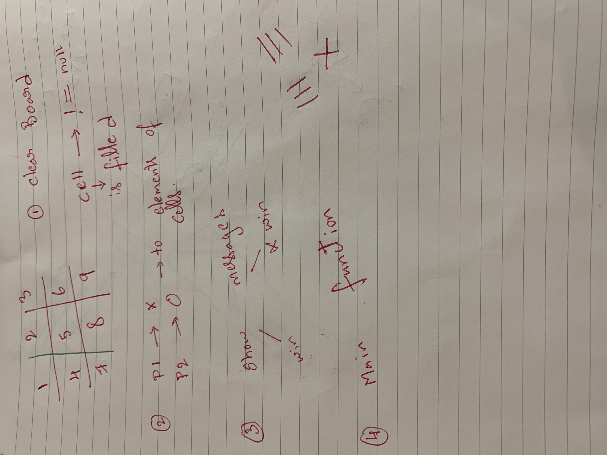
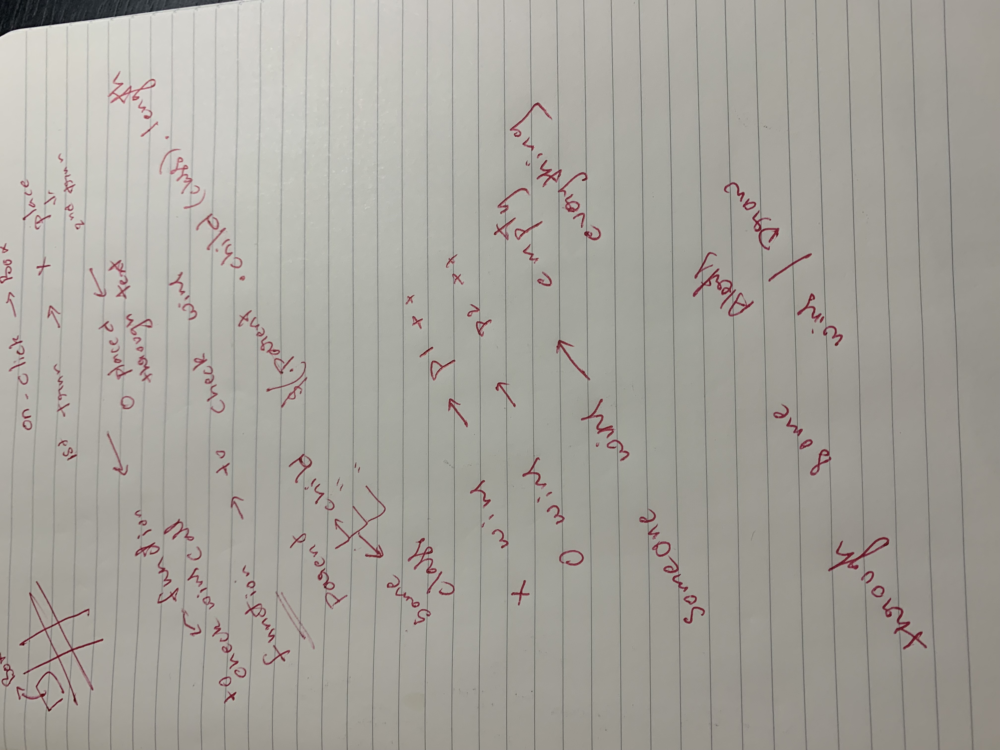

# Tic Tac Toe

Time to check HTML,CSS, Javascript and jQuery knowlwedge!!!

My job is to make the game  work using Javascript and jQuery logics.

- Make a HTML Page first using classes and ID's with tables to get the board
- Don't worry about CSS, just play around in the browser to find the best fit
- jQuery has already been added to the files or you can use the CDN 
- Finally elephant in the room --Javascript ----Make it work

The actual user stories:

**Gameplay:**
-First the page loads using  document ready function
- Then  Player 1 (X) is the first player to go and make a move 
- When Player 1 clicks an *empty* cell, it should be marked with an "X", and `Current Player` should switch to two
- When Player 2 clicks an *empty* cell, it should be marked with an "O", and `Current Player` should switch back to one
- If a player clicks a cell that has already been marked, they should see an alert letting them know that the cell in question has already been taken

**Winning:**
- When a player gets three in a row in any direction, the board should should be wiped clean, and that player's score should be incremented
- The game should then start over with the losing player getting to go first

